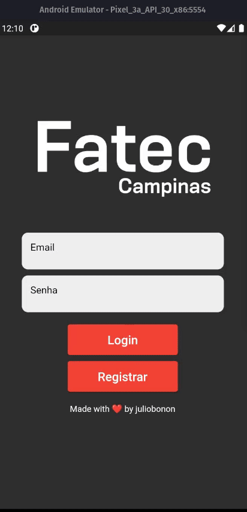

# sigascript

- Criação de um serviço de scrapping para buscar informações do Aluno como notas, ausências, presenças e matérias.
- Criação de um Aplicativo Mobile para exibir essas informações (Flutter e Firebase).
- Melhorar a Usabilidade do Usuário.

## Projeto em Andamento

Apesar do projeto ainda estar sendo desenvolvido, a tela inicial com os dados do aluno já pode ser visualizada:

